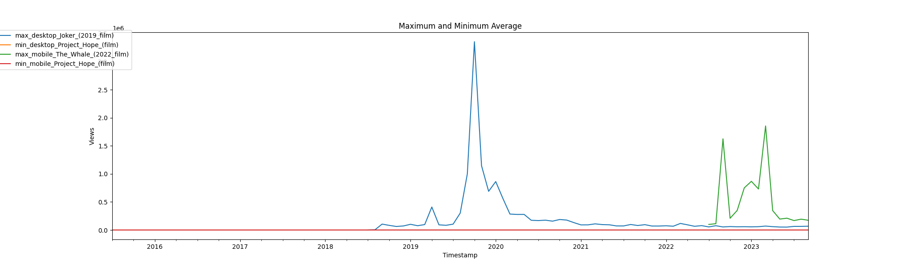
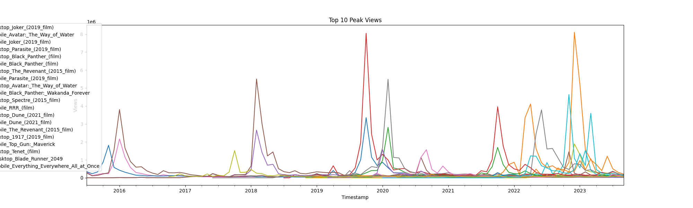
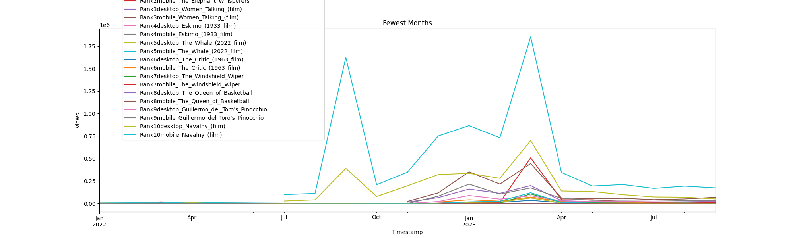

# DATA512_HW1

This project aims to collect views data for Wikipedia using list of articles. The Wikimedia REST API is leveraged to fetch data about the articles which is then processed and the results are then stored in JSON files. The JSON file contains the articles sorted by name. The code contains the complete process of data acquisition, preprocessind and conducting the three analysis which involves calculation average views per article based on access, articles with the highest and lowest views and building analysis to view the insights.

# Prerequisites
Before using this code, ensure you have the following prerequisites installed:

    Python 3.x

# Folder Hierarchy

├── Data/ 
│   ├── thank_the_academy.AUG.2023.csv.xlsx 
├── Code/ 
│   └── Analysis.ipynb 
└── Output/ 
&emsp; ├── academy_monthly_cumulative_201507-202309.json 
&emsp; ├── academy_monthly_mobile_201507-202309.json 
&emsp; └── academy_monthly_desktop_201507-202309.json 
&emsp; └── Fewest10_plot.png 
&emsp; └── Max_Min_plot.png 
&emsp; └── Top10_plot.png 

# Data sources and API documentation

[Article List](https://docs.google.com/spreadsheets/d/1A1h_7KAo7KXaVxdScJmIVPTvjb3IuY9oZhNV4ZHxrxw/edit?usp=sharing)
[API Documentation](https://wikitech.wikimedia.org/wiki/Analytics/AQS/Pageviews)

# Reproducibility

The following steps need to followed to run this code seamlessly :

&emsp; Clone this repository to your local machine. 
&emsp; Install all the required libraries (pandas, matplotlib, json, os). 
&emsp; Run Analysis.ipynb to generate all the required jsons and all three analysis visualizations 
&emsp; View Visualizations 

Output and Results :
First Analysis

Second Analysis

Third Analysis

